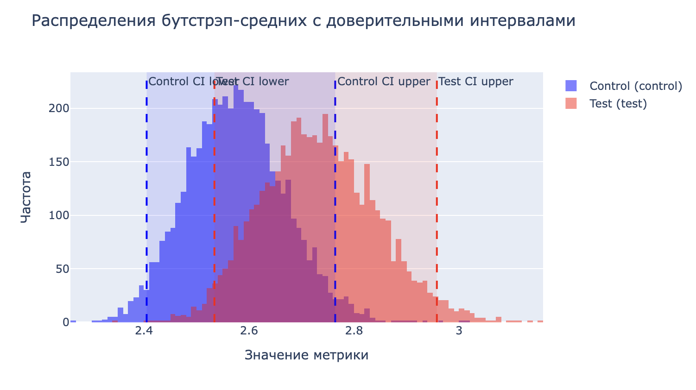
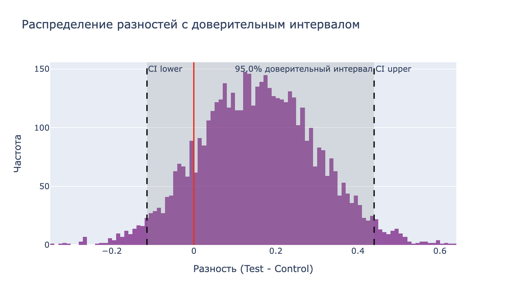

# Bootstrap A/B Test Analysis

Python-класс для проведения A/B-тестирования с использованием бутстрэп-метода. Позволяет сравнивать метрики между двумя группами, оценивать статистическую значимость различий и визуализировать результаты.

## Особенности

- 📊 Бутстрэп-анализ для сравнения средних значений между двумя группами
- 🔍 Расчет p-value и проверка статистической значимости
- 📈 Визуализация распределений и разностей между группами
- 🎯 Расчет доверительных интервалов для средних и разностей
- 📝 Автоматическая интерпретация результатов
- 🖥️ Интерактивные графики с использованием Plotly


---

## 📦 Установка

### Вариант 1: установка из исходников
Вариант 1: установка из исходников
```bash
git clone https://github.com/Aproject618/bootstrap_package.git
cd bootstrap_ab_test
pip install .
```
### Вариант 2: установка напрямую через pip
```bash
python3 -m pip install git+https://github.com/Aproject618/bootstrap_package.git
```

### 🚀 Быстрый старт
```Python
from bootstrap_ab_test import BootstrapABTest
import pandas as pd
import numpy as np

# Создаем тестовые данные
np.random.seed(42)
data = pd.DataFrame({
    'group': ['control']*1000 + ['test']*1000,
    'metric': np.concatenate([
        np.random.normal(10, 2, 1000),
        np.random.normal(10.5, 2, 1000)
    ])
})

# Инициализация и запуск анализа
ab_test = BootstrapABTest(
    data=data,
    metric='metric',
    group_column='group',
    group_names=['control', 'test'],
    n=5000,               # Количество бутстрэп-итераций
    alpha=0.05,           # Уровень значимости
    two_sided=True,       # Двусторонний тест
    random_state=42       # Для воспроизводимости
)

ab_test.run()            # Запуск анализа
ab_test.summary()        # Вывод результатов
```
### Пример вывода
Двусторонний тест, p-value = 0.034
Разница является статистически значимой на уровне 5%

Доверительные интервалы (уровень доверия 95%):
Контрольная группа (control): [9.8763, 10.1254]
Тестовая группа (test): [10.3721, 10.6218]
Разность (Test - Control): [0.2458, 0.4965]

Параметры класса

    data: DataFrame с данными

    metric: Название столбца с анализируемой метрикой

    group_column: Название столбца с группами

    group_names: Список из двух названий групп [control, test]

    n: Количество бутстрэп-итераций (по умолчанию 10000)

    alpha: Уровень значимости (по умолчанию 0.05)

    two_sided: Флаг двустороннего теста (по умолчанию False)

    random_state: Seed для воспроизводимости (по умолчанию None)

Методы

    run(): Запускает анализ

    summary(): Выводит интерпретацию результатов

    get_results(): Возвращает сырые результаты анализа

Визуализации

Класс автоматически строит два интерактивных графика:

    Распределения бутстрэп-средних с доверительными интервалами

    Распределение разностей между группами с доверительным интервалом
[](https://www.python.org/)
[](https://www.python.org/)

### 📜 Лицензия
MIT Licence

### 🧑‍💻 Автор
Разработано с заботой об аналитиках и продуктовых командах ❤️
Ramis Sungatullin